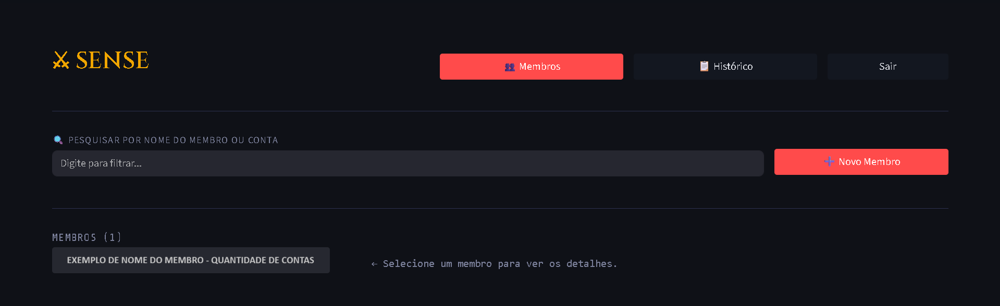
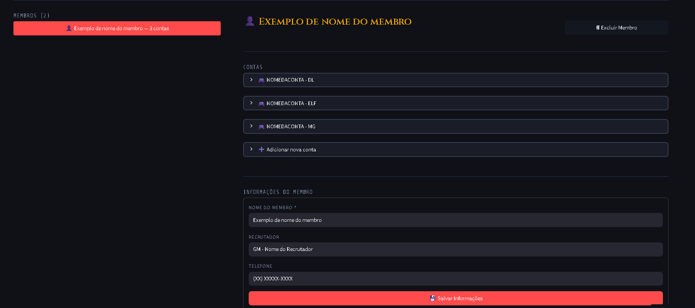
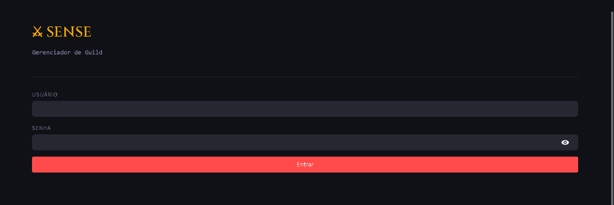
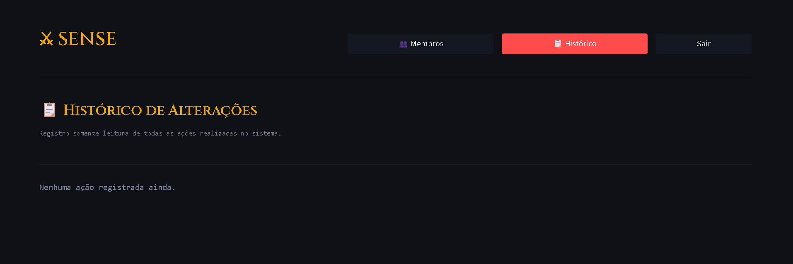

# Gerenciador de Guild

Um app que gerencia a entrada, alteração e exclusão de membros da guild Sense do servidor privado do jogo Mucabrasil. O app utiliza a linguagem Python totalmente pura e com banco de dados em SQL hospedado na Supabase gratuitamente. 

O app pode armazenar o nome do membro, nome e quantidade de contas que ele tem adicionado na guild, nome do recrutador que fez a entrada dele, telefone para contato e grupo nas rede sociais.

Com um sistema de login para admins e GMs da guild poderem ter autonomia sem a necessidade de compartilhar a mesma conta e gerenciar com mais agilidade.

Além de armazenar o histórico de cada alteração com o nome do usuário que alterou, data e hora com segurança sem que possam ser adulteradas mesmo pelos admins para manter a confiabilidade das informações e leitura futura.

